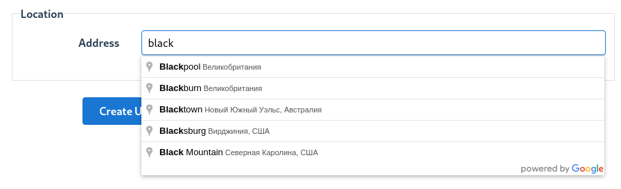
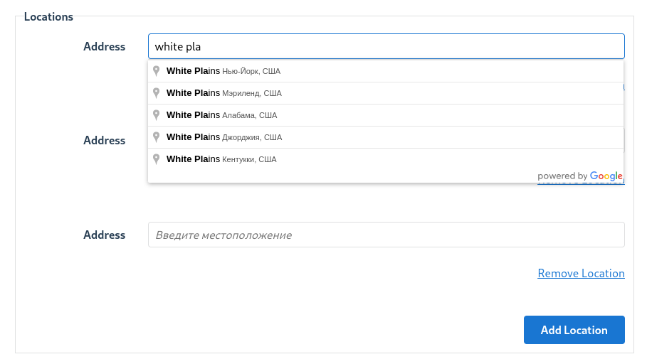

# Google Places

Google Places is a service that helps developers find information about places using HTTP requests. The service provides a database of places, including their names, addresses, phone numbers, user ratings and reviews. The service also provides a set of tools to search for places, add new places, and manage user reviews.

Google offers a very extended documentation for the service, including [API reference](https://developers.google.com/places/web-service/overview), [quick start guide](https://developers.google.com/places/web-service/quickstart), [detailed guides](https://developers.google.com/places/web-service/intro) and [examples](https://developers.google.com/places/web-service/examples).

As of now, the service does not offer any Ruby gem that makes it easy to integrate the service into a Rails application. In general it's not necessary to use a gem, since the service is based on HTTP requests and responses.

The provided guide is based on the Google Places API version 3.52, April 2023.

## Prerequisites

In order to work with the Google Places API, the developer needs to provide some credentials. Typically they are placed in the `.env` file for development.

- `GOOGLE_PLACES_KEY` - the unique key for identifying the developer. It can be obtained in Google Developer console at https://console.developers.google.com/apis/credentials.

## Usage

Usually the application backend does not work with the Google Places API directly. It is more likely that the frontend application uses the API, initializes it with the key and then makes requests to the API on its own, and passes the address entry itself  to the backend. The frontend could be, for example, a React app that uses the API to find places, add new places, etc.

However, some of the functionality of Google Places can be useful for developing an admin panel that is built into the backend application. For example, we use it to search for addresses in the admin interface built with the `administrate` gem.

### Google Places autocomplete field

Suppose the model has a field in which we want to store the address. We want to let the user enter the beginning of the address and, based on what is already entered, suggest the full address so that the user can select it from a list. The Google Places API provides this functionality.

From the `administrate` gem's point of view, each model is represented by some dashboard. Model fields are objects of some classes. Since we are adding some custom functionality, we need to add a custom field class to the application:

```ruby
# app/fields/address_field.rb

require 'administrate/field/base'

class AddressField < Administrate::Field::Base
end
```

In the model dashboard this field should be registered:

```ruby
class LocationDashboard < Administrate::BaseDashboard
  ATTRIBUTE_TYPES = {
    ...
    address_json: AddressField,
    ...
  }.freeze
  ...
end
```

And the view template for the field itself is added:

```slim
// app/views/fields/address_field/_form.html.slim

.field-unit__label
  = f.label :formatted_address, 'Address'
.field-unit__field
  = f.text_field :formatted_address, class: :formatted_address
  = f.hidden_field field.attribute, class: field.attribute
```

The view for the model editing page is pretty standard. The new custom class field is added to its field array, so there is no need to handle it separately. The only change is that the page must load the Google Places API script:

```slim
// app/views/admin/users/_form.html.slim

script async='' src="https://maps.googleapis.com/maps/api/js?key=#{ENV['GOOGLE_PLACES_KEY']}&callback=initMap&libraries=places&v=weekly"
= form_for([namespace, page.resource], html: { class: 'form' }) do |f|
  - if page.resource.errors.any?
    #error_explanation
      h2 = t('administrate.form.errors', pluralized_errors: pluralize(page.resource.errors.count, t('administrate.form.error')), resource_name: display_resource_name(page.resource_name, singular: true))
      ul
        - page.resource.errors.full_messages.each do |message|
          li.flash-error = message
  - page.attributes(controller.action_name).each do |attribute|
    div class="field-unit field-unit--#{attribute.html_class} field-unit--#{requireness(attribute)}"
      = render_field attribute, f:
  .form-actions
    = f.submit
```

Finally, we need to define `initMap` method which is called when Google Places API script is loaded. It initializes the address field and adds the autocomplete functionality:

```javascript
// app/assets/javascripts/application.js

function initMap($item) {
  if (typeof $item === 'undefined') {
    $item = $('.field-unit--address-field')
  }
  if ($item.length === 0) { return }

  const formatted = $item.find('.formatted_address').get(0)
  const stringified = $item.find('.address_json').get(0)

  const autocomplete = new google.maps.places.Autocomplete(formatted, {types: ['(cities)']})
  autocomplete.addListener('place_changed', () => {
    const place = autocomplete.getPlace()
    stringified.value = JSON.stringify(place)
  })
}
$('.field-unit--nested').on('cocoon:after-insert', function (e, insertedItem, originalEvent) {
  const $item = $(insertedItem).find('.field-unit--address-field');
  initMap($item);
});
```

That's all. After these changes, we have the ability to add locations to different models, both through the `has_one` association:
```ruby
location: Field::HasOne
```


and `has_many`:

```ruby
locations: Field::NestedHasMany
```


The Google Places API returns the addresses in the form of JSON array, where every item is an object with fields like `address_components`, `formatted_address`, `geometry`, `name`, `place_id`, `types`, etc. Usually we use the first two. `address_components` is the array of address parts such as country, province, city, etc. `formatted_address` is the formatted representation of the address, ie string such as **Beverly Hills, 90210, CA, USA**. The field uses `formatted_address` value to show the address when loaded, and interacts with the backend using the value with the name `address_json`.
